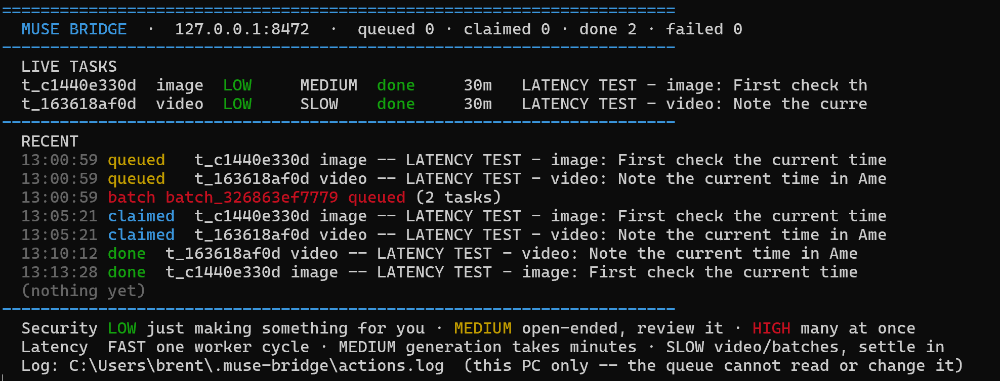

# Muse Bridge

Dispatch work to a full agent — not just a model — from any tool that speaks OpenAI.

This repo holds the bridge: a tiny Python front door that runs on your
workstation. Your local tools (Claude Code, Codex, opencode, OpenWebUI,
SillyTavern, curl, anything with a `base_url` + `api_key` + `model` field)
talk to it like it's an OpenAI-compatible API. Behind the front door is a task
queue, and behind the queue is your AI agent: a real agent with web access,
files, memory, and media generation. It picks tasks up through a tunnel, does
the work, and returns the answers.

The key idea: **latency is minutes, granularity is tasks.** This isn't for
tight autocomplete loops — it's for "research this," "generate that," "handle
these ten things overnight," dispatched from whatever tool you're already in.

```
your tools ──OpenAI-shaped──▶ Muse Bridge (127.0.0.1:8472) ──queue──▶ tunnel ──▶ your agent
   ▲                                                                               │
   └────────────── answers (chat / png / mp3 / mp4) ───────────────────────────────┘
```



*The live console: queue counters, live tasks with security color + latency
axis, and the recent-action log. Tray mode (`--tray`) parks it by the clock
with a tooltip showing the same counters.*

- **Chat** → research, writing, analysis, code review, second opinions
- **Images** → generated PNGs, base64 in an OpenAI-style response
- **Audio** → text-to-speech MP3s (voiceovers, read-aloud, narration)
- **Video** → ~10s MP4 clips from a text prompt (stitch for longer)
- **Batches** → queue N tasks in one call, collect results in the morning

**v1.0.** Chat + image round-trips verified end-to-end over a Tailscale
Funnel tunnel. MCP toolset (5 tools) built and smoke-tested; awaiting first
live use.

## Quickstart

Three steps (full guide in [`SETUP.md`](SETUP.md)):

1. **Run it** (workstation, Python 3, stdlib only):
   ```powershell
   python muse_bridge.py
   # or: python muse_bridge.py --tray   (hides the console, parks an icon by the clock)
   ```
   First run prints two secrets once, stored in
   `C:\Users\<you>\.muse-bridge\config.json`:
   - **LAN bearer key** → paste into your local tools. Model name: `muse-bridge`.
   - **Queue path** (`/q/<random>/`) → give to your agent with your tunnel URL.
     Never put it in a tool config; it's tunnel-only.
2. **Tunnel the queue paths only** (`/q/<cap>/pending`, `/q/<cap>/result/<id>`,
   `/q/<cap>/status`) — Tailscale Funnel or Cloudflare Tunnel. Never expose
   the whole port.
3. **Tell your agent** "queue is up at `<tunnel-url>` with cap path `/q/<...>/`"
   and it enables its worker (polls every ~5 min) plus an optional morning digest.
   Have it save the worker protocol — tunnel URL, cap path, the
   `pending?claim=1` / `result/{id}` endpoints, and the safety rules — to its
   long-term memory. Then any future session can run the worker without being
   briefed again.

## Connect your tools

Anything that can point at a custom OpenAI-compatible endpoint works. The
pattern is always the same: base URL `http://127.0.0.1:8472`, API key = your
LAN bearer key, model = `muse-bridge`.

| Tool | How | Status |
|------|-----|--------|
| **Claude Code** | MCP server (`muse_bridge_mcp.py`): `claude mcp add muse-bridge -- python C:\apps\muse\muse_bridge_mcp.py`. Five worker tools: `muse_task`, `muse_image`, `muse_say`, `muse_video`, `muse_batch`. Dispatch work like a subagent. | 🛠️ built, ready |
| **Codex** | MCP server via `~/.codex/config.toml` (`mcp/configs/codex-config.toml`) — same five tools, headless dispatch from scripts. | 🛠️ built, ready |
| **opencode** | MCP server via `opencode.json` (`mcp/configs/opencode.json`). | 🛠️ built, ready |
| **Cline** | MCP server via `cline_mcp_settings.json` (`mcp/configs/cline_mcp_settings.json`). | 🛠️ built, ready |
| **goose** (Block) | MCP extension via `~/.config/goose/config.yaml` (`mcp/configs/goose-config.yaml`). | 🛠️ built, ready |
| **OpenWebUI** | Admin → Connections → add OpenAI API connection: base URL + key, model `muse-bridge`. Chat UI for the queue. | 🔶 expected |
| **SillyTavern** | API Connections → OpenAI-compatible: custom endpoint + key. Personas that can hand tasks to a real agent. | 🔶 expected |
| **Tavo** | Custom OpenAI-compatible provider (TTS/audio routes). | 🔶 expected |
| **zcode / hermes / ohmypi** | If it speaks OpenAI-style chat completions, it works — exact config TBD. PRs welcome. | 🔶 TBD |
| **curl / scripts** | Raw HTTP, OpenAI shapes. Great for cron jobs and pipelines. | ✅ verified live |

Legend: ✅ verified end-to-end · 🛠️ built, awaiting first use · 🔶 standard
OpenAI-compatible config, not yet tried — report back.

Full per-host MCP setup (all five hosts) in [`mcp/INSTALL.md`](mcp/INSTALL.md);
copy-paste configs live in `mcp/configs/`.

## Task-tray mode

`python muse_bridge.py --tray` hides the dashboard console and parks the
flower icon by the clock: hover for the version and live queue counts,
right-click to show/hide the dashboard or quit; double-click toggles the
console. Task completions pop a notification. Still stdlib-only (raw
`ctypes`, icon drawn in code — no asset file, no packages), and any tray
failure falls back to the normal console with the reason written to the
action log. Launch with `pythonw.exe` for no window at all; the tray
becomes the whole UI. On the very first run the console stays visible so
you can copy the two secrets it prints once.

## MuseBridge.exe (one file, no console)

Build it on Windows — PyInstaller can't cross-build (see `BUILD-EXE.md`):

```bat
pip install pyinstaller
cd C:\Users\brent\apps\muse
pyinstaller MuseBridge.spec
```

`dist\MuseBridge.exe` holds the interpreter, the bridge, *and* the MCP
server in one file, wearing the flower as its icon. Double-click → bridge
starts straight into tray mode; `MuseBridge.exe --mcp` serves the five MCP
tools over stdio for Claude Code / Codex / opencode / Cline / goose. The
exe reads the same `~/.muse-bridge/config.json`, so your keys carry over.
SmartScreen will ask once (unsigned) — expected.

## What you can do with it

### Via the OpenAI endpoint

**Research & knowledge work**
- Deep research questions from any chat UI — the agent browses the live web,
  reads sources, and returns a writeup
- Overnight research batches: queue 10 questions, read the digest in the morning
- Competitive teardowns, product comparisons, market scans
- "Explain this" — paste an error, a paper abstract, a contract clause

**Code-adjacent (from your editor/CLI agent)**
- Second-opinion code review: paste a diff, get a review from an agent with
  no stake in the code
- Documentation generation from source you paste in
- Commit messages, PR descriptions, changelogs, release notes
- Test data and fixtures, edge-case enumeration
- Architecture sanity checks ("here's my plan, poke holes in it")

**Writing & content**
- Drafts, rewrites, summaries, tone shifts
- Meeting notes → action items; long threads → briefings
- Morning briefing batch: "summarize X, Y, Z overnight"

**Media generation**
- Images: thumbnails, concept art, mockups, social assets (`1024x1024`,
  base64 PNG back)
- Audio: article narration, video voiceovers, read-aloud for long docs,
  podcast-style briefings
- Video: ~10s clips from a prompt — b-roll, animated logos, teasers
  (stitch clips for longer pieces)

**Pipelines & automation**
- Cron + curl: nightly repo digest, inbox triage drafts, changelog assembly
- Batch endpoint: one call queues chat/image/audio tasks together; poll or
  wait for the morning digest
- Home-lab glue: any script that can POST JSON can hire an agent for a step

### Via MCP (worker tools)

The MCP server treats the other end as a **colleague agent** inside your
coding tool — best when the task benefits from the agent's full context
(memory, files, web) rather than raw speed:

- `muse_task` — well-specified research, design docs, "second engineer"
  reviews, writing release notes, triaging issues. Not for tight
  edit/compile loops (minutes of latency).
- `muse_image` — concept art and assets saved straight to
  `~/dev-fleet/out/` on the workstation.
- `muse_say` — TTS MP3s to `~/dev-fleet/out/` — demo voiceovers,
  read-aloud reviews.
- `muse_video` — ~10s MP4 clips to `~/dev-fleet/out/` from a text prompt.
- `muse_batch` — queue several tasks at once and collect the results;
  `wait:false` returns the batch id immediately for later polling.

The same pattern generalizes: any MCP host can wrap the HTTP routes the way
`muse_bridge_mcp.py` does.

### Ideas not yet tried (filter freely)

- SillyTavern persona whose "actions" are queue dispatches — a character that
  can actually go do things and report back
- OpenWebUI pipeline that routes hard questions to the agent, easy ones local
- Voice assistant loop: TTS out + STT in, the agent in the middle, via batches
- Game NPC dialogue generation in bulk (one batch call, dozens of lines)
- CI job that has the agent summarize the nightly test failures in prose
- "Explain my own codebase to me" docs sprint: batch one task per module
- Accessibility: batch-convert a reading list to audio overnight
- Red-team: have the agent attack your plan while your local model defends it

## The console dashboard & local action log

The bridge window is a live dashboard: every queued task, its status, and
risk on two axes — **security as color** (🟢 LOW just making something for
you · 🟡 MEDIUM open-ended, review it · 🔴 HIGH many at once) and **latency
as a word** (FAST one worker cycle · MEDIUM generation takes minutes ·
SLOW video/batches, settle in). Files the worker reports touching are cited
under the task, with a review nudge when security isn't green. Every event also
appends to `~/.muse-bridge/actions.log` (JSONL) — written **only** by the
bridge process on your PC; the queue protocol has no route to read or change
it. Files the worker reports touching are logged as the worker's own claim.

## The mental model

| | Local model (Kobold, etc.) | Muse Bridge → agent |
|---|---|---|
| Latency | seconds | minutes |
| Best for | tight loops, autocomplete, chat | tasks, research, media, batches |
| Context | what you paste | its memory, files, web, tools |
| Cost | electricity | its worker schedule |

Use both. Fast local for the loop, the agent for the errands.

## Security design

This is the part we're proudest of: Muse Bridge is **one-way by
construction**. Your machines reach out; the agent only ever returns data.
There is no path — direct or creative — by which the agent (or anyone
holding its credentials) can execute code on your workstation. That's not
a limitation we worked around. It's the core security property of the
whole design.

**Three venues, three trust levels.** Chat sessions and the tunnel worker
live on the agent's machine: zero filesystem access to your PC, and the
bridge protocol exposes no file-write route — the queue surface is
`pending`, `result/{id}`, `status`, and that's everything. The bridge
server on your workstation stores results as inert data; nothing it
receives is evaluated or executed, because there is no command task kind.
The *only* thing on your machine that writes files is the MCP server
(`muse_bridge_mcp.py`), which runs locally **as you** and saves the
agent's media results to disk. The writer is your code, on your box,
under your user's hands.

**The narrowest possible blast radius.** The LAN bearer key never leaves
your machines (it gates `/v1/*`). The queue cap path (`/q/<random>/`) is
unguessable and tunnel-only — and even if it leaked, all it buys is a
task inbox: reading your queued tasks and posting bogus results. No
execution. No file writes. No reach into the dashboard or the local
action log (written solely by the bridge process; the queue protocol has
no route to either). The "files" a worker reports touching are logged as
its own unverified claim, and treated that way.

**The checklist:**

- The **LAN bearer key** never leaves your machines. It gates `/v1/*`.
- The **queue path** (`/q/<random>/`) is unguessable and tunnel-only. It is
  not a credential — don't put it in tool configs.
- The bridge binds `127.0.0.1` only. The tunnel exposes queue paths, never
  the whole port.
- Rotate keys by deleting `~/.muse-bridge/config.json` and restarting —
  both secrets regenerate. Then update your tools (and the agent's cap path).
- **Destructive actions ask first.** The worker answers and generates; it
  doesn't run irreversible operations without your confirmation.

## Limits, honestly stated

- **Latency is minutes, not seconds.** Worker polls every ~5 min; media takes
  minutes more. Task granularity, not tight loops.
- **No streaming** (`stream: false` only). The connection holds open up to
  15 min; after that, 504 — poll `GET /v1/tasks/<id>`.
- **Video**: ~10s clips, synthesized sound from a text mood description, no
  audio input.
- **Audio**: speech/TTS and podcast-style voices only. No song/music lookup.
- **Media returns base64** (~33% inflation). Keep video requests modest.
- **Server restarts wipe the in-memory queue.** For real durability, keep the
  bridge on a scheduled task / service.

## Files

- `muse_bridge.py` — the front door + queue + task-tray mode (workstation, stdlib only). `python muse_bridge.py --version` prints the build; the version also shows in the dashboard header and the tray tooltip, so you can tell a stale copy from a fresh one.
- `muse_bridge_mcp.py` — MCP server: 5 tools for Claude Code / Codex / opencode / Cline / goose (stdio, stdlib only)
- `mcp/INSTALL.md` — per-host MCP setup guide
- `mcp/configs/` — copy-paste configs: Codex (toml), opencode (json), Cline (json), goose (yaml)
- `SETUP.md` — full setup guide: tunnel options, tray mode, batches, troubleshooting

## Roadmap ideas

- Jev (TypeSafe.ai) judgement layer: offload worker decision-making — task
  triage, difficulty scoring, routing — to a judgement model instead of the
  worker's own heuristics
- Webhook callbacks instead of hold-open connections
- File download route (PDFs, zips) alongside base64 media
- Longer video via server-side clip stitching
- Persistent queue (sqlite) so restarts don't drop tasks
- Streaming for chat tasks

---

Built for one workstation and one agent, shared in case the pattern is useful.
Issues and integration notes (especially for the 🔶 rows) welcome.
